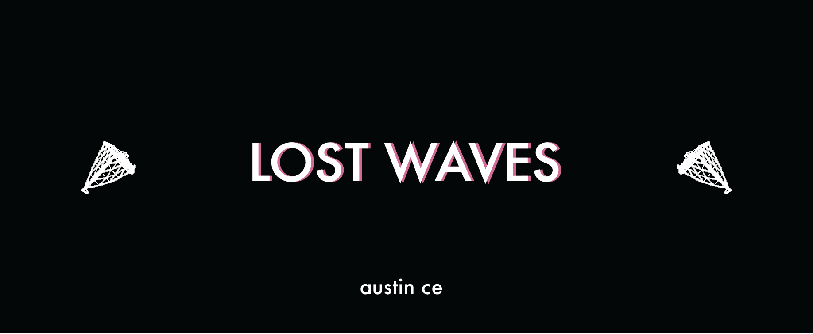
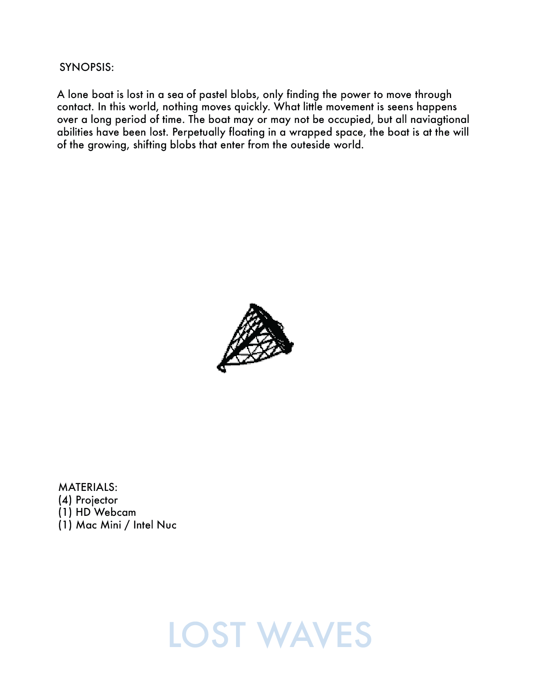
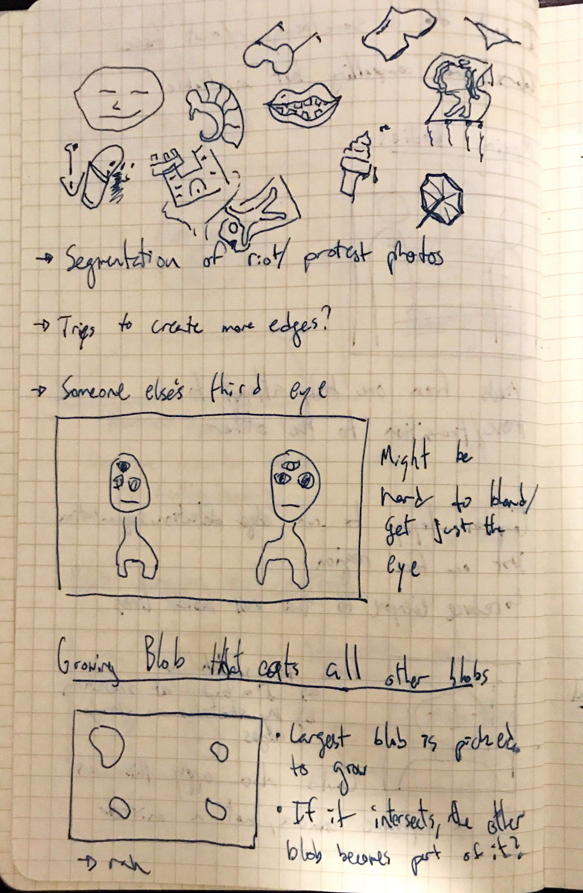
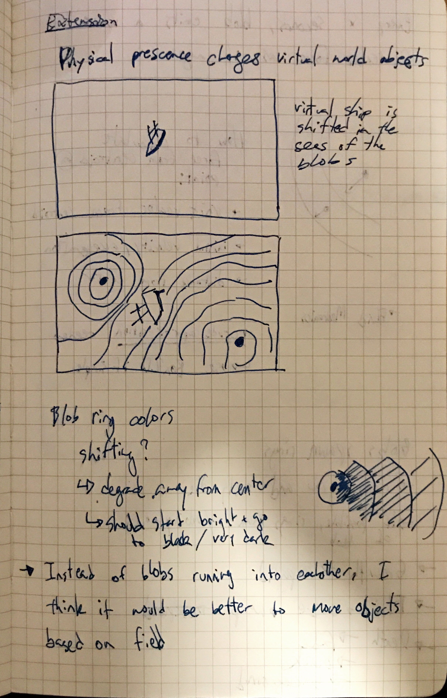
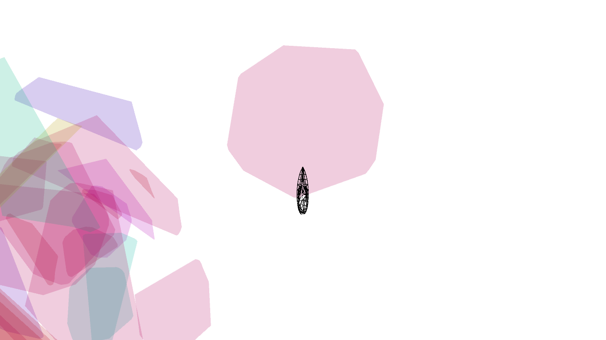
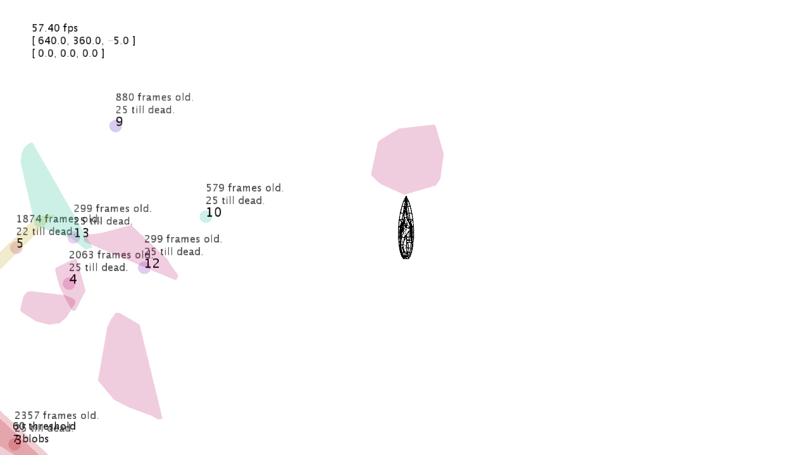
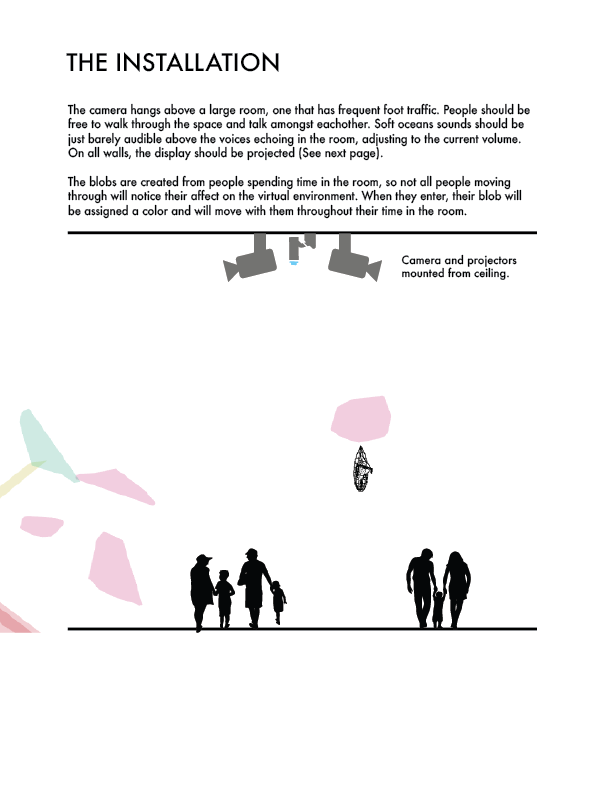
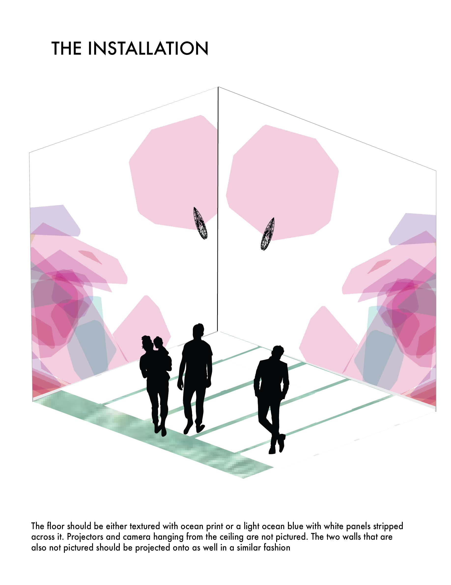

  

  
  

Built with [Processing](https://processing.org).  
Built in [Creative Programming 2](https://github.com/JeffThompson/CreativeProgramming2).

 

 

## Requirements

* Processing Video Library
* OpenCV for Processing Library

## Sketches

All my sketchbook sketches are in the [sketches](./sketches) folder. They are a mix of bad drawings and bad math.

<b>The first brainstorm:</b>  

## Final Screenshots

They don't quit have the same effect as they would projected onto the surrounding walls, but you get the gist.

  

 

<b>During development</b>  

  

## Installation Mockups

Everything involving the installation can be found in the [installation](./installation) folder.

<b>Installation</b>  

## Design Citations

<a href="https://www.freepik.com/free-vector/family-silhouettes_725263.htm">Family Silhouettes. Designed by Freepik</a>  
<a href="https://www.freepik.com/free-vector/icons-set-about-cameras_958833.htm">Camera Icons. Designed by Freepik</a>  
<a href="https://www.freepik.com/free-vector/business-team-outlines-pack_831669.htm">Business Team Silhouettes. Designed by Freepik</a>
